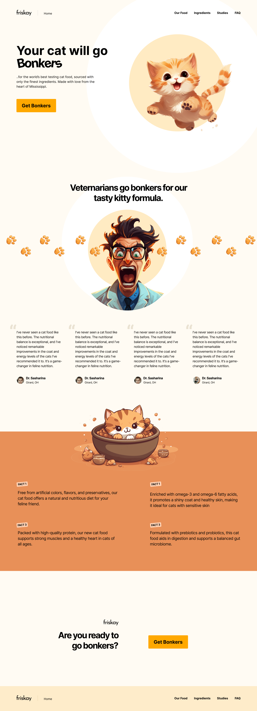

# Step 1: Frontend Coding Challenge

## 🎨 Design Reference

**Figma Link:** https://www.figma.com/community/file/1325253298373460646

**Design Preview:**



## 📋 Requirements

### Technology Stack

- **HTML**: Use bare HTML (no frameworks required)
- **CSS Framework**: TailwindCSS (required)
- **Responsive Design**: Must work on all screen sizes (mobile to desktop)

### Technical Specifications

1. **HTML Structure**

   - Use semantic HTML elements
   - Ensure proper accessibility with alt tags, labels, etc.
   - Clean, well-organized code structure

2. **TailwindCSS Implementation**

   - Use TailwindCSS utility classes for all styling
   - No custom CSS required (stick to Tailwind utilities)
   - Leverage Tailwind's responsive breakpoints

3. **Responsive Design**
   - **Mobile First**: Start with mobile design (`sm:` breakpoint)
   - **Tablet**: Optimize for medium screens (`md:` breakpoint)
   - **Desktop**: Ensure great experience on large screens (`lg:` and `xl:` breakpoints)
   - Test on various screen sizes

## 🚀 Getting Started

1. **Setup TailwindCSS**

   ```html
   <!-- Add this to your HTML head -->
   <script src="https://cdn.tailwindcss.com"></script>
   ```

2. **Create your workspace**

   - Create a folder with your name (e.g., `john-doe/`, `jane-smith/`)
   - If the folder doesn't exist, create it first
   - Inside your folder, create `index.html`
   - Follow the design reference closely
   - Pay attention to spacing, colors, and typography

   **Example structure:**

   ```
   Step1/
   ├── your-name/
   │   └── index.html
   ├── design.png
   └── README.md
   ```

3. **Responsive Breakpoints**
   - `sm`: 640px and up
   - `md`: 768px and up
   - `lg`: 1024px and up
   - `xl`: 1280px and up

## ✅ Checklist

- [ ] Matches the design in `design.png`
- [ ] Uses only TailwindCSS classes
- [ ] Responsive on mobile (320px+)
- [ ] Responsive on tablet (768px+)
- [ ] Responsive on desktop (1024px+)
- [ ] Clean, semantic HTML structure
- [ ] No custom CSS written
- [ ] Accessible (proper alt tags, labels, etc.)

## 📱 Testing Your Work

Make sure to test your implementation on:

- Mobile devices or browser dev tools mobile view
- Tablet sizes
- Desktop screens
- Different browsers if possible

Good luck and have fun coding! 🎉
